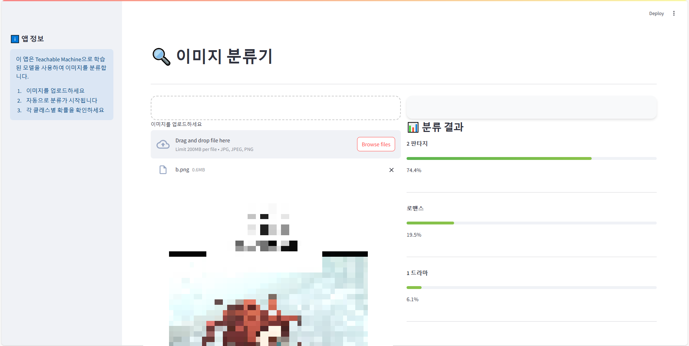

# WebtoonClassifier
웹툰의 카테고리(장르)를 분류하는 AI 모델

# 사용법
1. 다음 라이브러리들을 설치합니다:
```
pip install streamlit tensorflow numpy pillow
```

2. streamlit을 실행합니다:
```
streamlit run stream.py
```

# 예시


# 라이선스
[MIT LICENSE](./LICENSE)로 배포됩니다.